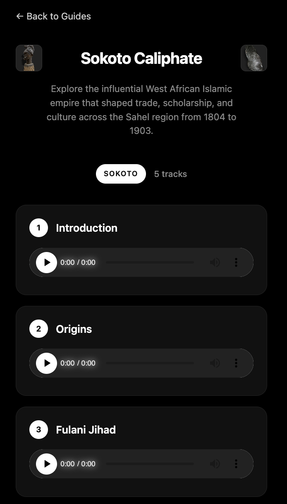
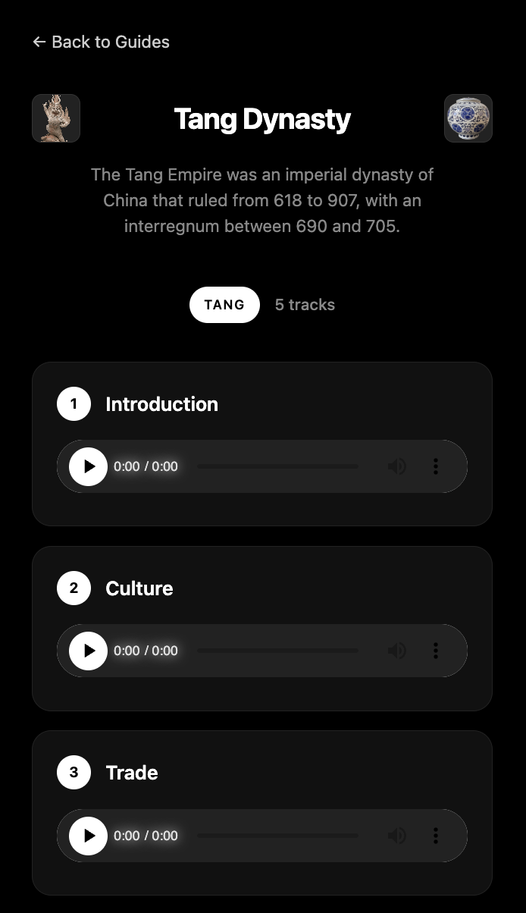

# 🚀 Museum Audio Guide Platform

<div align="center">
  


*A lightweight, server-driven audio guide platform built for seamless audio playback*

</div>

## 📋 Overview

This project demonstrates a lean audio guide platform using **FastAPI** and **Jinja2** for server-side rendering. The architecture prioritizes performance and simplicity through deliberate technology choices that eliminate JavaScript overhead while providing robust audio playback functionality. This approach showcases understanding of when to avoid over-engineering and select the right tools for specific requirements.

## 🏗️ Architecture Decisions & Technical Rationale

### Server-Side Rendering Strategy
The decision to use **FastAPI + Jinja2** over modern JavaScript frameworks was driven by specific technical requirements:

- **Performance Optimization**: Server-side rendering eliminates the need for initial JavaScript bundle loading, reducing Time to First Contentful Paint (TFCP)
- **Seamless Integration**: Direct template population occurs during the HTTP response cycle, avoiding additional API calls that would create waterfall loading patterns
- **Reduced Complexity**: Eliminates the need for state management libraries, bundlers, and complex build processes that would be overkill for this use case

```python
@app.get("/guides/{id}", response_class=HTMLResponse)
async def read_guide(request: Request, id: int):
    guide_query = Guide.__table__.select().where(Guide.__table__.c.id == id)
    guide = await database.fetch_one(guide_query)
    
    if not guide:
        raise HTTPException(status_code=404, detail="Guide not found")
    
    # Efficient join operation - fetches related tracks in single query
    tracks_query = Track.__table__.select().where(
        Track.__table__.c.guide_id == id
    ).order_by(Track.__table__.c.order_num)
    tracks = await database.fetch_all(tracks_query)
    
    # Data populated directly into template context - no serialization overhead
    return templates.TemplateResponse(
        request=request,
        name="guides.html",
        context={"guide": guide, "tracks": tracks}
    )
```

This approach demonstrates understanding of when server-side rendering provides superior performance characteristics compared to client-side alternatives.

### Database Design & Relationship Modeling

The relational model was architected to facilitate efficient data relationships and minimize query complexity:

```python
class Guide(Base):
    __tablename__ = "guides"
    id: Mapped[int] = mapped_column(primary_key=True, autoincrement=True)
    title: Mapped[str] = mapped_column(String(50), nullable=False)
    description: Mapped[str] = mapped_column(String(300), nullable=False)
    category: Mapped[str] = mapped_column(nullable=False)
    # Bidirectional relationship enables efficient back-population
    tracks: Mapped[List["Track"]] = relationship(back_populates="guide")

class Track(Base):
    __tablename__ = "tracks"
    id: Mapped[int] = mapped_column(primary_key=True, autoincrement=True)
    title: Mapped[str] = mapped_column(String(50), nullable=False)
    file_path: Mapped[str] = mapped_column(nullable=False)
    duration: Mapped[float] = mapped_column(nullable=False)
    order_num: Mapped[int] = mapped_column(nullable=False)
    # Foreign key constraint ensures referential integrity
    guide_id: Mapped[int] = mapped_column(ForeignKey("guides.id"))
    guide: Mapped["Guide"] = relationship(back_populates="tracks")
```

**Key Design Decisions:**
- **Foreign Key Constraints**: Ensures data integrity at the database level, preventing orphaned tracks
- **Bidirectional Relationships**: SQLAlchemy's `relationship()` enables efficient lazy loading and eager loading strategies
- **Order Management**: `order_num` field allows for flexible track sequencing without relying on insertion order
- **Metadata Separation**: File paths stored as strings rather than binary data, optimizing for both storage efficiency and retrieval performance

## 🎵 Audio Handling & Storage Strategy

### File System vs Database Storage Analysis

**Strategic Decision**: Store audio file metadata in the database while keeping actual audio files on the filesystem.

**Technical Rationale:**
- **Memory Efficiency**: Storing large binary objects (BLOBs) in PostgreSQL would significantly increase memory usage and backup sizes
- **I/O Performance**: File system access is optimized for large file streaming, whereas database queries excel at metadata operations
- **Caching Benefits**: Web servers and CDNs can efficiently cache static files, but not database BLOBs
- **Scalability Considerations**: Future migration to cloud storage (S3, CloudFlare R2) becomes trivial with path-based references

```python
@app.get("/tracks/{track_id}/audio")
async def stream_audio(track_id: int):
    # Single database query to fetch metadata
    track_query = Track.__table__.select().where(Track.__table__.c.id == track_id)
    track = await database.fetch_one(track_query)
    
    if not track:
        raise HTTPException(status_code=404, detail="Track not found")
    
    # FileResponse handles range requests, caching headers, and efficient streaming
    return FileResponse(track["file_path"], media_type="audio/mpeg")
```

**HTTP Streaming Benefits:**
- **Range Request Support**: FileResponse automatically handles HTTP 206 partial content requests for audio scrubbing
- **Efficient Memory Usage**: Streams file in chunks rather than loading entire file into memory
- **Browser Compatibility**: Proper MIME type headers ensure consistent playback across browsers

### Database Connection & Lifecycle Management

```python
DATABASE_URL = ""
database = Database(DATABASE_URL)

@app.on_event("startup")
async def startup():
    engine = create_engine(DATABASE_URL)
    Base.metadata.create_all(engine)  # Automatic schema creation
    await database.connect()

@app.on_event("shutdown") 
async def shutdown():
    await database.disconnect()  # Graceful connection cleanup
```

This demonstrates understanding of proper resource lifecycle management and automatic schema migration capabilities.

## 🔄 Template Rendering vs JavaScript: Technical Deep Dive

### Why Jinja2 Eliminates JavaScript Complexity || Abstraction Is a Tax on Performance 

The comparison below illustrates the architectural advantages of server-side template rendering for this specific use case:


### Server-Side Template Rendering (Chosen Approach)
```html
<div class="track-list">
    
    <div class="track-item">
        <div class="track-header">
            <span class="track-number">{{ track.order_num }}</span>
            <h3 class="track-title">{{ track.title }}</h3>
        </div>
        <div class="audio-player">
            <!-- Direct URL generation - no API calls needed -->
            <audio controls preload="none">
                <source src="/tracks/{{ track.id }}/audio" type="audio/mpeg">
                Your browser does not support the audio element.
            </audio>
        </div>
    </div>
    
</div>
```

### Client-Side JavaScript Alternative (Avoided)
```html
<div id="track-list" class="track-list"></div>
<script>
// Requires additional HTTP request - increases page load time
fetch('/api/guides/1/tracks')
    .then(response => response.json())
    .then(tracks => {
        const trackList = document.getElementById("track-list");
        
        tracks.forEach(track => {
            // DOM manipulation - more verbose and error-prone
            const trackItem = document.createElement("div");
            trackItem.className = "track-item";
            
            // Template literal injection - potential XSS vulnerability if not sanitized
            trackItem.innerHTML = `
                <div class="track-header">
                    <span class="track-number">${track.order_num}</span>
                    <h3 class="track-title">${track.title}</h3>
                </div>
                <div class="audio-player">
                    <audio controls preload="none">
                        <source src="/tracks/${track.id}/audio" type="audio/mpeg">
                    </audio>
                </div>
            `;
            trackList.appendChild(trackItem);
        });
    })
    .catch(error => {
        // Additional error handling required for network failures
        console.error('Failed to load tracks:', error);
    });
</script>
```

**Technical Advantages of Server-Side Approach:**

1. **Network Efficiency**: Eliminates the need for separate API endpoints and additional HTTP requests
2. **Error Handling**: Template rendering failures are handled at the application level rather than requiring client-side error boundaries
3. **SEO Optimization**: Content is immediately available to search engines and social media crawlers
4. **Performance Predictability**: No JavaScript parsing/execution time variability
5. **Security**: Server-side template escaping eliminates XSS vulnerabilities from dynamic content injection

### CRUD Operations & Data Validation

```python
@app.post("/guides/")
async def post_guide(payload: GuideCreate):
    # Transaction-like behavior using database.execute
    guide_query = Guide.__table__.insert().values(
        title=payload.title,
        description=payload.description,
        category=payload.category
    )
    guide_id = await database.execute(guide_query)
    
    # Batch insert optimization for related tracks
    if payload.tracks:
        for track_data in payload.tracks:
            track_query = Track.__table__.insert().values(
                title=track_data.title,
                file_path=track_data.file_path,
                duration=track_data.duration,
                order_num=track_data.order_num,
                guide_id=guide_id  # Foreign key relationship maintained
            )
            await database.execute(track_query)
    
    return {"message": "guide saved", "guide_id": guide_id}
```

**Pydantic Schema Validation:**
```python
class TrackCreate(BaseModel):
    title: str
    file_path: str
    duration: float
    order_num: int

class GuideCreate(BaseModel):
    title: str
    description: str  
    category: str
    tracks: Optional[List[TrackCreate]] = None  # Supports batch creation
```

This demonstrates understanding of data validation, type safety, and efficient batch operations.


## 📸 Application Screenshots

### Home Page - Landing Interface

*Clean, minimal interface showcasing available audio guides*

### Audio Guide - Sokoto Historical Exhibit

*Demonstrates track listing with integrated HTML5 audio controls*

### Audio Guide - Tang Dynasty Cultural Exhibit  

*Sequential track organization with metadata display*

## 🛠️ Technology Stack & Justification

| Component | Technology | Rationale |
|-----------|------------|-----------|
| **Web Framework** | FastAPI | Type hints, automatic OpenAPI docs, excellent async performance |
| **Database** | PostgreSQL | ACID compliance, JSON support, excellent full-text search capabilities |
| **ORM** | SQLAlchemy 2.0 | Modern async syntax, powerful relationship modeling, query optimization |
| **Templates** | Jinja2 | Battle-tested, secure auto-escaping, minimal learning curve |
| **Audio Streaming** | HTML5 + FileResponse | Native browser support, efficient streaming, no additional dependencies |
| **Validation** | Pydantic | Runtime type checking, automatic documentation, JSON schema generation |

## 📁 Project Structure & Organization

```
├── main.py              # FastAPI application, routes, and startup configuration
├── models.py            # SQLAlchemy ORM models with relationship definitions
├── schemas.py           # Pydantic models for request/response validation
├── templates/           # Jinja2 HTML templates with template inheritance
│   ├── base.html        # Base template with common layout
│   └── guides.html      # Guide-specific template with audio controls
├── static/              # Static assets (CSS, images, client-side scripts)
│   ├── css/            # Modular CSS with component-based organization
│   └── images/         # Static images and icons
├── screenshots/         # Application screenshots for documentation
└── audio_files/        # Local audio file storage (production: cloud storage)
    ├── sokoto/         # Organized by exhibit/guide
    └── tang/
```

This structure demonstrates understanding of separation of concerns, modular organization, and scalable project architecture suitable for team development environments.

---

*This project implements modern Python web development patterns, efficient database design, and strategic technology selection for audio streaming applications. The architecture demonstrates understanding of performance optimization, security considerations, and maintainable code organization suitable for production deployment.*