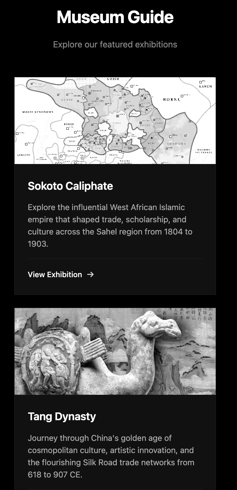

# 🏛️ Museum Audio Guide Platform

*A modern digital audio guide system designed specifically for museums and cultural institutions*

## 📱 What This System Does

This platform provides visitors with an interactive audio guide experience through their own smartphones, tablets, or computers. Instead of traditional handheld devices, visitors can access rich audio content about your exhibitions using their personal devices.

**Key Features:**
- **Easy Access**: Visitors simply connect to your museum's WiFi and visit a simple web address
- **Professional Audio**: High-quality audio tracks with detailed exhibition information
- **User-Friendly Interface**: Clean, intuitive design that works on any device
- **Multiple Exhibitions**: Support for multiple concurrent exhibitions with organized track listings
- **No App Downloads**: Works directly in web browsers - no apps to install or update

## 🖥️ How It Looks and Works

### Main Gallery Page
The homepage presents a clean, museum-quality interface showcasing your current exhibitions. Each exhibition is displayed as an elegant card with:
- Exhibition title and description
- Preview image or artifact representation
- Clear navigation to audio content

### Exhibition Audio Guides
When visitors select an exhibition, they access a dedicated page with:
- Exhibition overview and context
- Sequential audio tracks organized by topic or gallery area
- Built-in audio controls (play, pause, volume, progress tracking)
- Professional artifact imagery and cultural context

**Example Exhibitions Shown:**
- **Sokoto Caliphate**: West African Islamic empire history (1804-1903)
- **Tang Dynasty**: Chinese golden age culture and art (618-907 CE)

## 🏢 Why This Approach Benefits Your Museum

### **Cost-Effective Solution**
- **No Hardware Costs**: Eliminates the need to purchase, maintain, and replace physical audio guide devices
- **Reduced Theft/Loss**: No expensive equipment for visitors to potentially lose or damage
- **Lower Maintenance**: No charging stations, cleaning protocols, or device repairs

### **Enhanced Visitor Experience**
- **Personal Devices**: Visitors use their own familiar smartphones with their preferred headphones
- **Hygiene Benefits**: Completely contactless experience - important for health-conscious visitors
- **Accessibility**: Works with visitors' existing accessibility tools and settings
- **Flexible Timing**: Visitors can pause, replay, or skip content based on their interests

### **Operational Advantages**
- **Easy Content Updates**: Add new exhibitions or update existing content without physical changes
- **Multi-Language Support**: Easily expandable to support multiple languages
- **Analytics Capability**: Track which exhibitions are most popular and optimize content accordingly
- **Scalable**: Supports unlimited concurrent visitors without additional hardware

### **Professional Presentation**
- **Brand Consistency**: Fully customizable to match your museum's visual identity
- **High-Quality Audio**: Crystal-clear narration and background audio enhance the learning experience
- **Rich Media Integration**: Combine audio with relevant images and artifact photography

## 🌐 WiFi Network Integration

### **Simple Setup Process**

**Step 1: Network Configuration**
Your existing museum WiFi network can easily support this system. The platform requires:
- Standard internet connection (your current setup is likely sufficient)
- A dedicated web address (like `audioguide.yourmuseum.org`)
- Integration with your existing network infrastructure

**Step 2: Visitor Access**
The visitor experience is straightforward:
1. Connect to museum WiFi (your existing guest network)
2. Open any web browser on their device
3. Visit the provided web address
4. Browse and listen to exhibition content immediately

**Step 3: Staff Management**
Museum staff can:
- Update exhibition content through a simple web interface
- Add new audio tracks or exhibitions as needed
- Monitor usage and popular content
- Customize the experience for special events or temporary exhibitions

### **Technical Requirements (Simplified)**

**What You Need:**
- Existing WiFi network (most museums already have this)
- Internet connection capable of streaming audio (standard broadband is sufficient)
- A web domain or subdomain for the audio guide platform

**What We Provide:**
- Complete software platform hosting
- Content management system for your staff
- Technical support and maintenance
- Initial setup and staff training

**Bandwidth Considerations:**
- Audio streaming uses minimal bandwidth (similar to playing music from streaming services)
- System is designed to work efficiently even during peak visitor times
- No impact on other museum digital systems or guest WiFi usage

## 📊 Content Management

### **Adding New Exhibitions**
Museum staff can easily add new content through a user-friendly interface:
- Upload audio files recorded by your curators or professional narrators
- Add exhibition descriptions and metadata
- Organize tracks in the desired sequence
- Preview content before making it available to visitors

### **Updating Existing Content**
- Modify descriptions or add new audio tracks to current exhibitions
- Temporarily disable exhibitions during renovations or changes
- Schedule content to appear/disappear for special events or traveling exhibitions

## 🔒 Reliability and Security

### **Visitor Privacy**
- No personal information collected from visitors
- No app installation required
- Works entirely through standard web browsers
- No location tracking or personal data storage

### **System Reliability**
- Designed to handle high visitor volumes during peak times
- Automatic backup systems ensure content is always available
- Works offline-capable for basic functionality during internet disruptions
- Regular maintenance and updates managed remotely

## 🎯 Summary

This audio guide platform transforms how visitors experience your museum by leveraging technology they already carry and networks you already have. It provides a professional, cost-effective solution that enhances visitor engagement while reducing operational complexity and costs.

The system grows with your museum - easily accommodating new exhibitions, special events, and changing visitor needs while maintaining the high-quality experience your visitors expect.